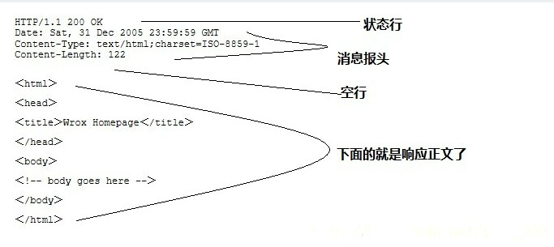

# HTTP教程

### 背景

> 听了rock老师的tornado的讲课，感觉受不了，不习惯他的东北普通话。但又准备跟上他的上课节奏，因此，基于我的理解，和网络资源，特根据自己的感觉，制作了这个教程。
>
> 当然，更要时刻提醒自己理解和复习。如有错误，希望大家指正。

### 课前的基础知识

* 基本的网络知识
* 基本的前端知识，做过一些前端页面更好。

> 以上，非必须要求。如果有，理解上来更好。

### HTTP简介

* 网络上的数据传递，是将数据打包(封装) 成 报文 的形式 传递。类似于邮局 的包裹 。

* 封装后报文 ，根据 TCP/IP 通信 协议在客户端和服务端传递。 相当于包裹的地址联系方式。

* 当包裹(报文)，到达 目的地后，会根据 端口号(联系方式) 投递给对应端口监听的服务。

  > 网络主机的IP地址 表明 网络通讯 的 地址。但一台主机 可能会有多个服务。为了区分报文来源的服务或是请求的服务，网络主机 拿出两个字节(2^16)，来表明接收报文对应的服务，即端口号。
  >
  > HTTP服务器，默认监听80端口，所有客户端的连接请求都会发往这个端口。
  >
  > 服务端，根据客户的请求，向客户发送响应信息。

### HTTP消息结构

* 协商的标准

  > 上文中，简单说明了网络报文连接。事实上，应用层服务HTTP，的连接，两者要相互协商。这包括 ：客户请求内容，客户的浏览器标识，使用HTTP的版本号，(客户运行的环境)。而服务端 根据 服务程序 返回 对应的信息 和请求 内容。
  >
  > 这种协商对应的标准 协议 即 HTTP协议。它定义 **报文传输的格式**，大致上，我们需要了解 客户请求消息格式，和服务端响应格式。

#### 客户端请求消息的格式：REQUEST

1. 客户端请求消息 ：根据数据的作用，分为三个部分。请求行(**request line**)，请求头(**request header**)， 请求数据(**date**)。

   * 请求行： 和服务端交互信息。包括：**请求方法**，**请求地址URL**，等。`<method> <request-URL> <version>`

   * 请求头部：客户端环境信息。 其中比较重要的字段名：**User-agent**，**Referer**,**Cookie**,**Connection**等。定义方法：`字段名：值;`。

   * 请求数据。请求体。如果请求要传递数据，会封装在这里面。

2. 请求方法 (**request method**)

   > HTTP1.1 共有8种客户端的请求方法。其中我们接触到，最常用：GET,POST.
   >
   > GET:请求指定页面信息，明文，常用URL传输。
   >
   > POST：向指定资源URL提交数据 ，并请求数据处理。

3. 请求头信息(**request header**)

   >  **User-agent**: 客户端 浏览器的标识，服务器根据 这个标识 判断客户 使用的类型，并返回对应的代码。
   >
   >  **Referer**:  客户请求的来源地址，比如网页地址A中，打开页面中的链接网址B,那么表明网址B的Referer是A。如果没有，表明是直接打开网址B。
   >
   >  **Cookie**: 由服务端生成发来的信息，存储在客户端缓存中。在客户端下次请求，会传送给服务端。用来识别客户端，或之前客户端的一些操作信息等。 
   >
   >  Connection: 长连接。HTTP链接是每次连接只处理一个请求。在服务器处理完客户请求，会断开连接。每一个URL都必须建议一个独立的TCP连接，N多的URL连接加重了服务器负担，且易引起阻塞。因此，这里表明，建立一个持久连接。这里，可以通知终止TCP连接。HTTP/1.1默认的总为持久连接。

#### 服务端响应信息格式：Response

1. 服务端回应 信息：根据作用分为三类，状态行(**Status-Line**)，响应报头(**Response Header**)，响应正文。

   * 状态行：回应请求链接的信息。包括：HTTP版本号，请求链接响应的状态(**Status Code**)，状态的简单描述。`<version> <status> <reason-phrase>`。
   * 响应头部：传送响应的一些附加信息。它给出服务器的信息及请求资源的进一步访问信息。比较重要字段名：**Content_Type,Date,Expires,Refresh,Set-Cookie**。定义方法类似于请求头部。
   * 响应正文：请求资源的代码。

2. 请求链接响应状态(**Status Code**)：资源请求结果代码。共分为五类：每一类都由三位数字表示。

   > 1XX: 收到请求，需要继续处理。
   >
   > 2XX：成功。请求操作被成功接收并处理。200 ：请求成功。用于GET和POST请求。
   >
   > 3XX：重定向。完成请求，需要采取进一步的动作。301：永久重定向。302：临时重定向。
   >
   > 4XX： 客户端出错。请求包含语法错误，或是无法处理。404：Not Found.
   >
   > 5XX： 服务器错误。服务器在处理中，出现错误，无法完成有效的请求。504: Gateway time-out.

3. 响应头部 (**Response Header**). 回应客户端信息进一步描述。

   > **Content_Type**： 标明文档类型。客户请求资源分为文本和二进制类型。文本可通过SMTP协议传输，二进制类型通过MIME协议传输。这里标明传输文件的类型，比如 ：content_type为application/x-img 标明传输的为img图片格式的文件。客户端会根据content_type调用相应的程序来解读文件。 
   >
   > **Date**： 传输时的GMT时间。
   >
   > **Expires**: 文档过期时间，文档缓存使用，以便于静态文件不重复加载，节省资源。
   >
   > **Refresh**: 文件刷新时间，可设置多少秒后，刷新文档，或是读取指定的页面。`setHeader("Refresh", "5; URL=http://host/path")`.
   >
   > **Set-Cookie**: 设置cookie.

### 查看HTTP状态方法

* 建议使用firefox或是chrome 浏览器。
* 按键 **F12**， 调出浏览器开发者模式。在弹出的模块中 ，使用网络(network)标签。刷新测试的网页，在所有(all),点击下载的URL文件，即会弹出 URL 对应文件 的 消息头。它包括响应头部和请求头部。

### 其它补充知识

* 一些理论知识，仅做理解使用。

  > B/S架构：Browser/Server. 浏览器/服务器结构。Browser:Web浏览器。它将极少数事务逻辑在前端实现，主要事务逻辑在服务器端实现，然后传输给客户端Browser。**显示逻辑**交给web浏览器，**事务处理逻辑**放在webAPP服务器。
  >
  > B/S架构，一般使用三层架构，即：Browser显示端，WebAPP业务逻辑端，DB数据存储端。
  >
  > 优点：客户端有浏览器即可，不用下载。客户端不用升级，升级服务端即可。
  >
  > 缺点：浏览器标准不同，设计上面需要兼容。速度和安全方面，需要花费巨大设计成本。

* 这里主要是理解报文是按一定格式进行通讯会话。重点是 格式中标明的常用 状态描述。

* 使用tornado 做后台框架开发。

  * 首先，需要 根据 **请求头部信息** 进行处理。
  * 然后，设置 **响应头部信息**。比如cookie,缓存，date,refresh,Session,等。 
  * 再次，对请求进行，**事务逻辑处理** 和 **数据操作处理**。 
  * 最后，对响应请求，做 **返回信息处理** 。  