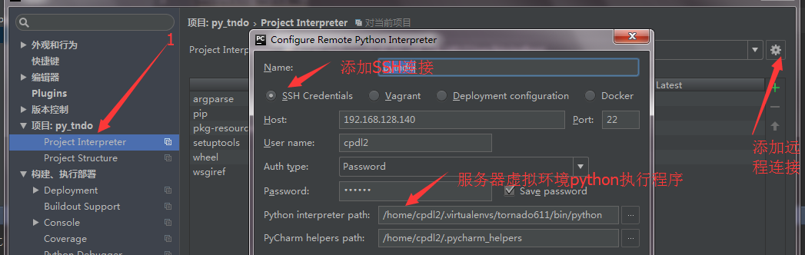

### 开发环境

#### ubuntu16.04.2

1. 开机命令行启动：

  > 1. 在图形桌面打开虚拟终端：`sudo systemctl set-default multi-user.target`
  > 2. 启动到桌面：`sudo systemctl start lightdm`
  > 3. 恢复桌面启动： `systemctl set-default graphical.target`

2. 命令行修改默认语言：`sudo vi /etc/default/locale ` ，改后重启主机。

  ```shell
   LANG="en_US.UTF-8"
   LANGUAGE="en_US:en"
  ```

3. 改变IP地址为静态：(我在VM中使用nat网络，所以网关和DNS为同一个)
  >
  > 1. 通过 `ifconfig` 和 `route -n`  命令，查看本机网卡接口，地址，和网关。
  >
  > 2. `sudo vi /etc/network/interfaces `, 追加以下代码：
  >
  >    ```shell
  >    auto ens33
  >    iface ens33 inet static
  >    address 192.168.128.140        #分配的地址
  >    gageway 192.168.128.2        #查询到的网关
  >    netmask 255.255.255.0
  >    dns-nameservers 192.168.128.2 #DNS 解析
  >    ```
  >
  >  3. 重启网络服务：`sudo /etc/init.d/networking restart`

4. SSH连接：

  > 1. 更新软件：`sudo apt-get update`
  > 2. 安装ssh: `sudo apt-get install openssh-server`
  > 3. 开启服务：`sudo service ssh start` ,查看 服务状态：`sudo service ssh status`

#### python服务器环境

* 安装步骤： python2.7 --> python 2.7 包管理工具 --> python 隔离运行环境。


* python 版本：2.7

  ```shell
  which python
  python -V #确认处理是2.7.12，否则安装：
  #sudo apt-get install python2.7
  #ln -s /usr/bin/python2.7 /usr/bin/python
  ```

* 安装包管理工具 setuptools。作用：简单的创建和分发Python包,特别是拥有依赖关系。

  > `sudo apt-get install -y python-setuptools`

* 安装包管理工具pip

  ```shell
  wget https://bootstrap.pypa.io/get-pip.py  --no-check-certificate  #pip,python安装脚本
  sudo python get-pip.py
  ```

* 通过配置文件，更改pip源地址为国内镜像

  > 配置文件需要手动建议，存放位置：`~/.pip/pip.conf,或 ~/.config/pip/pip.conf，或/etc/pip.conf`

  ```shell
  [list]
  format = columns
  [global]
  trusted-host = mirrors.aliyun.com
  index-url = http://mirrors.aliyun.com/pypi/simple
  # 或是豆瓣源。
  #trusted-host = pypi.douban.com
  #index-url = http://pypi.douban.com/simple
  ```

* 安装virtualenv 和 virtualenvwrapper, 用来创建一套“隔离”的Python运行环境.

  * 安装命令：`sudo apt-get install python-virtualenv` ,和 `sudo easy_install virtualenvwrapper`

  * 配置系统环境变量，调用命令来操作python虚拟运行环境

    > 1.  创建 虚拟环境存放 的目录： `mkdir $HOME/.virtualenv`
    >
    > 2. 创建全局变量 WORKON_HOME,执行扩展包脚本，让操作虚拟环境更加便捷。
    >
    >    ```shell
    >    # ~/.bashrc 追加：
    >    export WORKON_HOME=$HOME/.virtualenv
    >    source /usr/local/bin/virtualenvwrapper.sh
    >    # 添加后， source ~/.bashrc
    >    ```
    >
    > 3. 生成虚拟环境：`mkvirtualenv  [环境名字]` ，可选参数： `-p python_version` 指定环境使用python版本。
    >
    > 4. 切换虚拟环境：`workon [环境名字]`，如不跟环境名字，查看当前环境。
    >
    > 5. 退出虚拟环境：`deactivate`
    >
    > 6. 删除虚拟环境：`rmvirtualenv [环境名字]`

  * 最大打开文件数，epoll模式性能参数之一，`cat /proc/sys/fs/file-max`


#### 安装Tornado

* `sudo pip install tornado`

#### 安装mysql

* 需要安装服务端，客户端，客户端开发包

  ```shell
  sudo apt-get install mysql-server #安装时，需要创建数据库根帐号root的密码。这里我设 sincethen
  sudo apt-get install mysql-client
  sudo apt-get install libmysqlclient-dev
  ```

* 查看mysql开机启动服务,

  ```shell
  sudo apt-get install sysv-rc-conf #sysv-rc-conf 开机服务管理
  sudo sysv-rc-conf  #连接ubuntu的窗口要大。查找mysql
  sudo /etc/init.d/mysql status #查看mysql 运行状态，start, stop ,restart
  sudo netstat -apn |grep mysql #查看mysql 是否在监听着端口
  ```

* 修改mysql 存储的编码

  * 编辑mysql配置文件：`/etc/mysql/my.cnf`

    ```shell
    [client]         #客户端字符编码
    default-character-set=utf8

    [mysqld]        #服务端字符编码
    character-set-server=utf8
    collation-server=utf8_general_ci
    ```

* 查看mysql 字符编码

  * 连接 mysql 服务端: `mysql -u root -p`  ，输入之前创建时，设置的 root密码。

  * 查看字符编码。配置修改后，需要重启服务读取配置文件。`sudo /etc/init.d/mysql restart`

    ```shell
    mysql> show variables like '%char%';
    +--------------------------+----------------------------+
    | Variable_name            | Value                      |
    +--------------------------+----------------------------+
    | character_set_client     | utf8                       |
    | character_set_connection | utf8                       |
    | character_set_database   | utf8                       |
    | character_set_filesystem | binary                     |
    | character_set_results    | utf8                       |
    | character_set_server     | utf8                       |
    | character_set_system     | utf8                       |
    | character_sets_dir       | /usr/share/mysql/charsets/ |
    +--------------------------+----------------------------+
    8 rows in set (0.02 sec)

    mysql> show variables like '%colla%';
    +----------------------+-----------------+
    | Variable_name        | Value           |
    +----------------------+-----------------+
    | collation_connection | utf8_general_ci |
    | collation_database   | utf8_general_ci |
    | collation_server     | utf8_general_ci |
    +----------------------+-----------------+
    3 rows in set (0.00 sec)
    ```

  * 创建数据库时，指定默认字符。`create database  DATABASE_NAME  default character set utf8`

* redis数据库

  * 安装：`sudo apt-get install redis-server`
  * 启动服务端： `redis-server`
  * 启用客户端：`redis-cli`

#### pycharm,连接服务器开发环境

* 安装pycharm ，这里不多做介绍。

* 创建python项目pytndo 。(file-->new project) ,存放路径为本地：`E:/pytndo`

* 本地所有项目编码默认设置，设置为utf-8。

  > 路径：`File文件 --> Setting设置-->Editor编辑器-->File Encoding文件编码` 下的IDE Encoding 和 Project Encoding 值 改为utf-8.

* 代码同步。将本地项目与远程服务器项目关连，更新文件后自动上传。

  > 1. 配置路径：`File-->Settings --> Build,Execution,Deployment--> Deployment` 。选项：Connection,Mappings.
  > 2. 在关连前，我们需要确认条件：本地项目目录(**E:/pytndo**)  和 服务器项目同步目录 (假设为：**/home/cpdl/pytndo**).
  > 3. 在配置路径下，点击“+” 号，创建连接名称，类型为SFTP.
  > 4. Connection配置：填写服务器远程SSH连接设置，包括 地址 登陆用户名和密码。注意选中保存密码，并测试 SFTP连接 正常(“**Test SFTP connection...**”)。
  > 5. Mappings 配置，同步目录设置。 本地项目目录 (**E:/pytndo**)， 远程项目同步目录(**/home/cpdl/pytndo**).
  > 6. 设置 本地项目文件 保存时，**自动同步到服务器目录**。配置路径 ：`Tools-->Deployment-->Options` 下的`Upload changed files automatically to the default server` 文件修改后对服务器文件操作：`On explicit save action(Ctrl+s)`.
  > 7. 至此，使用pycharm 编辑项目时，代码会自动同步到服务项目中。但是，由于编程环境和语言使用的版本可能不一致，下面同步使用服务器编程环境。


* 编程环境同步。让本地编程工具调用服务器语言编程环境。

  > 1. 在服务器中创建虚拟python 运行环境。
  >
  > 2. 获取虚拟环境运行python命令执行的程序文件。
  >    ```shell
  >    mkvitrualenv tnd_1  #创建环境tnd_1
  >    workon tnd_1        #使用环境
  >    which python        #获取此环境下python命令执行的程序文件。
  >    /home/cpdl/.virtualenvs/tnd_1/bin/python
  >    ```
  >
  > 3. 在pycharm中配置：`File-->Settings-->Project:pytndo-->Project Interpreter` ,添加 项目使用的远程环境。在左侧显示的齿轮上，选择`Add Remote` 。弹出窗口中，添加 SSH Credentials连接，其中 `Python interpreter path:` 要填上步获取到的python执行文件。





* 使用pycharm编程工具 调用SSH 命令 ，来远程连接服务器。

  > 配置路径：`tools-->start ssh session..-->Edit credentials.. ` ,添加SSH连接，或使用之前建立的SSH连接。

#### 服务器虚拟环境包管理

* 查看虚拟python环境包安装情况：

  ```shell
  workon tnd_1                #进入tnd_1
  pip install --upgrade pip    #更新pip管理软件
  pip list                    #查看安装的python软件包
  #大致上，可能需要安装：tornado, SQLAlchemy ,redis, PyMySQL,Pillow 等。
  pip install tornado            #安装tornado
  ```

#### 附加浏览器知识

* 服务器curl : `sudo apt-get install curl`

* chrome缓存处理：

  ```shell
  Ctrl+Shift+Del  清除Google浏览器缓存的快捷键
  Ctrl+Shift+R  重新加载当前网页而不使用缓存内容
  ```
----------------------------------
这一节，没多少要记的知识，主要是开发环境的搭建，跟着步骤建，即可。