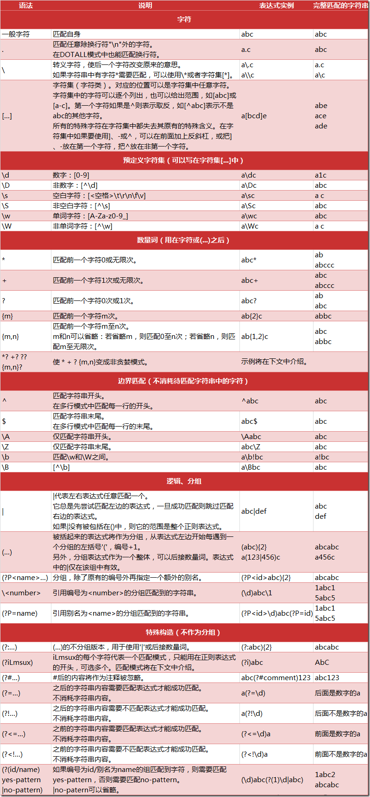
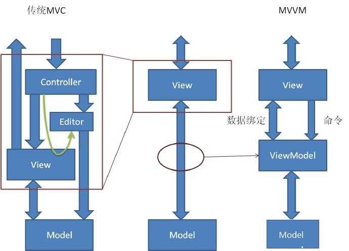

### web服务工作原理

- 服务器工作原理

  > 第一节中，讲解了HTTP报文格式。客户端将请求地址 和 请求或提交的数据，发送给服务器。服务端 根据客户端的请求地址及请求数据 ，根据 客户端 的浏览器信息 ，将服务器响应的状态 和报文 发送回去。
  >
  > 这里要考虑：
  >
  > 1. 服务器对请求和提交的数据 处理 是放在服务端 ，还是客户端？
  > 2. 如果客户端提交 数据，服务器必须要将 客户数据 存储 ，以便于以后 使用。
  > 3. 服务器 返回 的数据 如何处理，再展示给客户端观看？ 
  >
  > 举例来说：你去 饭店 吃饭。(你：客户端。饭店：服务器。服务员：数据报文。饭店吧台：服务端口。)
  >
  > 客户所有的点餐(**请求数据**)，都会汇聚 到 吧台（**接收请求数据**）。吧台汇总 菜单，将 菜品 反馈(**路由映射**) 给 特定的后厨制做 （**数据加工**）。后厨 要做 菜，须要 各种瓜果 蔬菜(**服务器数据**)。这些 蔬菜 在 库房 存放(**数据库**) ，或是处理待用(**radis**)。 
  >
  > 这里，数据加工尽量避免让客户加工。原因： 请求数据非法， 客户端不会加工（服务端使用PHP语言，客户端不能处理这种语言）。
  >
  > 客户带来一只鹿，但 是一次不能吃完，放在冰箱中存储。 (客户数据 存储)
  >
  > 加工好的数据 ，需要客户端 自行处理 展示 。  
  >
  > 例子，不是太合适。但大致上是这样处理。

- 静态页面和动态页面

  > 静态页面：指页面内容和显示 ，不会根据 请求链接 内的 请求数据 改变，而进行变化。（客户要吃土豆，对不起，后厨只会炒土豆丝）
  >
  > 动态 页面：指页面展示内容，会根据 请求对象 内数据 变化，而改变。(客户要吃土豆，后厨：你是要土豆泥，土豆片，煮土豆 还是 炸土豆?)
  >
  > 在网页上的表现：比如同一个请求链接地址，展示的数据 不会发生改变，没有交互性。早先的一些工厂宣传，等等。这都是静态页面。
  >
  > 动态网页：最常见，一些需要登陆用户网站 ，用户登陆后，展示内容不同。这就是最常见的动态网页。
  >
  > 这里不要将带有动画效果的静态页面，当做是动态网页。这里的动态，是指的交互性，而不是，视觉上的动态。

- 前端渲染和后端渲染

  > 简单来说：
  >
  > 前端渲染：网页的显示由客户端来操作。(客户点了一份水饺。加醋，加蒜汁，加辣椒？不管了，一起上，怎么吃，客户自己加)。
  >
  > 后端渲染：网页的显示 由 服务器根据配置好模板，然后用数据渲染页面，把渲染后页面返回客户端。(客户要吃棕子。做好的只有甜棕子，咸棕子。 而不是 棕子，糖，盐。自己加)
  >
  > 常见的比如：网页背景色 改变。 在前端 添加 下拉菜单，使用客户 浏览器 自行 渲染。而不用 将客户选择颜色 ，返回 服务器。再从服务器 返回 重新生成 的 网页数据。

- 大致上简单说明服务工作方式，但例子不会太合适。建议，同学们自己再去网上找点资料来看。

### 路由映射

> 这里，我们通过python使用tornado框架进行web开发。客户请求，是通过 报文 中 request-URL 请求链接 向服务器，请求网页信息。 服务器 提供 服务时，不管是 利用 IP地址建立 的独立主机 还是 利用一个IP地址 建立 多个虚拟主机，它 在接受客户请求时，必然 有对应 的域名（注意 域名 和 域 的区别）。
>
> 服务器接受 到客户请求 报文 后，将 request-URL 划去 服务主机对应 域名。剩下 即是 客户请求的 路径信息。python 服务器 用函数和类， 将客户请求 路径 信息 对应 。这种，就是广义 上的路径映射，也是我们所说的路由映射。大致上，我们要注意以下几种映射。
>
> 路径分割：请求地址为 `http://www.example.com/a.txt` ,那么响应的服务器域名为`www.example.com` ,前面的`http`表示协议，而`://` 将协议 和路径信息分隔开来。后面的路径 信息，用单斜线`/`表示路径的分隔。全路径的 最后一个信息不是文件，那么最后一个路径 信息后的`/`可省略不写。
>
> 举例来说：`http://www.example.com/wd?=m/` ,(搜索关键字为m), 最后一个`/` 省略不写。

- 简单路由映射

  > 例子：
  >
  > `r“/”,IndexHandler` 。这里 将路径 分割后，只有`/` 的请求，让函数IndexHandler处理。
  >
  > `r"/hello", HelloHandler` , 这里 路径  分割后，请求为hello 的，交由HelloHandler 处理。
  >
  > 这里r,指的是原始字符串(python中，定义原始字符串可以用小写r或者大写R开头) 。后面用双引号括起来的 表示匹配条件，后面表示处理方法。
  >
  > 匹配条件，由数字或字母组成，匹配条件变化不大，就是简单的路由匹配映射。

- 正则匹配路由映射

  > 相对来说，请求路径信息比较复杂的情况。比如 说请求书籍信息`/book/BOOK_ID` ,这里呢 BOOK_ID 是变化的书籍 编号 。由于书籍众多，肯定 不能一一写书籍对应 的处理方式。那么我们可以只定义一个函数处理这类请求。然后让函数，根据 请求书籍不同的编号 来，返回书籍信息。
  >
  > 这里这种路由信息的设定，需要对请求信息进行匹配。引入，正则表达式，对路径 过滤。
  >
  > 比如 ：`r"/book/([1-9]+)",BookInfoHandler` 。 这里使用正则式`([1-9]+)` ,表示书籍编号 。

* 匹配的**正则特殊符号**含义： 

    * **字符**：这包括，一般字符(数字字母下划线，不包括特殊符号)  ，`.`除"\n"外任意字符 ，转义符`\`, 字符集 `[...]` . 

      > 使用例子：
      >
      > `r"abc",` 路径为abc. 
      >
      >  `r"a\.b",`路径为`a.b`  ( 转义符常用来表示特殊符号)，再如`r"a\\b",` 表示 路径中包含反斜线 `a\b` 。
      >
      > `r"a.c"` ，匹配 a和c 之间 有任意 一个的字符，如abc,a1c,a?c，等。
      >
      > 字符集：表示当前位置字符可以是字符集合中的任一个。如：`r"a[abcde]f"` （连继可用`a-e` 表示）,那么acb,aab,aeb等都符合条件。

  * 预定义的**字符集**。

    >  `\d,数字[0-9]` ，`\D,非数字，[^\d]` ，`\s,空白字符，[<空格>\t \r \n \f \v]`， `\S,非空白字符，[^\s]`，`\w, 单词字符，[a-zA-Z0-9]` ,`\W ，非单词字符，[^\W]`

  * **数量词** ,用来做匹配的数量。如 aaa，可用`a{3}` 表示。

    > 常用来表示的数量：
    >
    > `*` 星号，匹配前面一个字符或分组 0+次，表示**大于等于**0次 。如：`acd*`,匹配到：ac,acd,acdd等。 
    >
    > `+` 加号，类似于星号，但最少匹配一次，表示**大于**0次。如：`acd+`，匹配到：acd,acdd,等。
    >
    > `?` 问号，前面一个字符要么有要么没有，匹配到**0次或一次**。如：`a?b` ,匹配到 b, ab。
    >
    > `{m} 和 {m,n}` ,表示匹配到前面字符m, 或是 m 至 n 次。如 `a{2}` ,表示 aa.  `a{1,3}` ,表示a 重复次数为1 到 3 次。`a{,3}` a 的0到3 次。`a{1,}` a 最少匹配1 次。
    >
    > `*? 和 +？和?? 和{m,n}?` , 非贪婪 匹配模式。 如字符串：ababc,那么`r"(ab)*"` 匹配到**abab**c, `r"(ab)*?"` 匹配到 **ab**abc.

  * **边界匹配**。指定匹配字符的位置。

    > `^` ,放在匹配条件最前面。表示以...开头。如`r"^abc" ` ,表示 匹配 **以abc 开头**的字符串。 
    >
    > `$`,放在匹配条件最后面。表示以...结尾。如：`r"abc$"` ，表示 字符串以 abc结尾。如123abc.
    >
    > 其它：
    >
    > `\A` 仅 匹配 字符串开头。`\Z` 仅匹配 字符串结尾。
    >
    > `\b` 匹配 单词字符 到非单词字符 之间。如 字符串 abc1234668&&**^@!# ,匹配条件：`r"b\b66"` ,其中`\b` 指定范围：以b开始到非字符之间，匹配条件为66 。
    >
    > `\B` , 指：`[^\b]`

  * **逻辑分组** 。上面是单个字符的匹配，这里常用来表示以字符串为匹配条件。

    > `|` ,表示 左右 任意匹配一串。如：`abc|def` ,匹配到的是：abc，或是def。
    >
    > `(...)` ,括号 表示 里面的字符串，当成一个分组来看。如：`r"(abc){2}"` ,将abc当成一个字符处理，匹配到的就是："abcabc"。再看：`r"s(abc|123)k"` ,字符串s**abc**kd, s**123**kefs 都可以匹配到。
    >
    > 另外，() 括号括起来的内容 ，可以被后面的匹配条件按序调用(以`\num`形式) 。如：`r"(\d)abc\1"` ,此处`\1`表示前面`(\d)` 匹配到的字符。
    >
    > `\<number>` ,上面提到的调用 。number对应的是括号 ，按序编号，从1依次增加。
    >
    > `(?P<name>...)` ,括号 也可另外 命名，让后面调用，调用时用`(?P=name)` 表示。如：`r"num(?P<id>\d)\.abc (?P=id)"` ，匹配到字符：num**1231**.abc**1231** 
    >
    > `(?P=<name>)` ,调用 前面另外 命名的分组。如上例所示。

  * **特殊构造** 。特殊分组方式。

    > `(?:...)` ，上面提到 括号 默认有个序号，被后面调用。 这里表明，这不会给序号，仅仅是一个逻辑字符串。
    >
    > `(?iLmsux)` : iLmsux ，每一个字符都表示 一个**匹配模式**。要在正则开头使用。i 表示忽略大小写，x 表示忽略空格 ，s 表示匹配任意字符，包括 换行符。m 表示多行模式。u 表示对Unicode字符大小写不敏感。d 表示“\n” 才被 认为是一行的中止。
    >
    > 注释：`(?#...)` ,这里表示正则的注释 信息。不做匹配条件用。
    >
    > **后向字符定位**：**跟随在字符后面**，表示字符的后边匹配条件。用来定位，让匹配更精确。
    >
    > `(?=...)` ,。表示必须出现匹配的字符串。如：`r"a(?=/d)"` ,表示匹配到的a 后面必须跟数字。不消费字符串内容。例子：aadf**a**1aaa.
    >
    > `(?!...)` ,表示不能出现的字符串。同上例：`r"a(?!/d)"` , 表示 匹配到的a,后面不能是数字。不消费字符串内容。例子：**aa**dfa1**aaa**.
    >
    > **前向字符定位**：**跟随在字符前面**，表示字符的前面的匹配条件。用来定位，让匹配更精确。
    >
    > `(?<=...)` ：前面需要匹配的字符串，不消费字符串内容。如：`r"(?<=\d)a"` ，表示匹配到的a 前面必须是数字，b1**a**sda.
    >
    > `(?<!...)`:  前面的字符串不允许是匹配到，不消费字符串内容。和上面相反。如：`r(?<!\d)a` :表示a 前面不能是数字 ，b1asd**a**.
    >
    > **三目运算匹配**。类似于三目运行符。
    >
    > `( ?(id/name) yes-pattern | no -pattern )` : 表示：如果给定的id或name 分组，前面有，那么这里用yes-pattern 条件来匹配 ，如果没有，则用 no-pattern 来匹配。例子：`r"(\d)abc(?(1)\d|abc)"` : 表示 匹配到的 abc 前面如果有数字 ，那么abc后面要跟数字 。否则，abc 前面不是数字 ，后面要跟abc . 字符串：**1** abc **2**  或 abc **abc**. 

- 404 和默认 路由映射

  > 上面简单的对网站 请求的链接，做了路径映射匹配，但可能客户的请求，如果没有匹配 到，怎么处理？
  >
  > 这里，我们需要利用正则 定义一个默认路由映射，放在**最下面**。如果 ，其它路由信息没有匹配到，那么就调用它来处理。常见的，默认路由 映射 是：首页，或是404网页。
  >
  > `r"/.* ",defaultHandler` ,函数 defaultHandler 返回 首页或404网页。

### 开发思想

#### WEB开发三架马车

- 总结开发思想

  > 要求：易维护，可扩展，高可用。设计思想：设计模式，分层MVC。代码理念：系统概念，数据流程。代码要求：高内聚低耦合。

- 熟悉开发环境

  > 工欲善其事，必先利其器。远程网络环境，单机网络环境，多进程，多线程环境，单线程环境，协作环境。

- 熟练开发工具

  > 编程语言，web框架，数据库，数据结构，算法

#### 工作重点--模块级别开发

- 模块开发流程
  1. 模块功能设计
  2. 编写设计文档：包括业务逻辑，接口定义，数据结构
  3. 审核
  4. 编代码，测试
  5. 上线

-----------

这节中，主要作了解。但正则表达式，是必须掌握的内容。下面，一些追加知识，做了解用。

#### 设计模式和MVC

- 设计模式

  > 软件开发过程使用软件设计方案。工厂模式，消费者模式，MVC模式，装饰器模式。

- MVC ：Model 数据模型, View 显示视图 , Controller 业务控制. 按业务逻辑，数据，界面显示分离架构方式 组织代码。  降低耦合，从而实现 易维护，高可用，可扩展。

  > Model: 数据存取。用于应用程序处理 数据逻辑 的部分。负责数据库存取数据。
  >
  > View: 数据视图和用户界面。用于应用程序 处理 数据显示 部分。 通常依据 模型数据 创建。
  >
  > Controller: 业务逻辑。应用程序 处理 用户交互 部分。 负责 业务逻辑的实现，并向模型发送数据。
  >
  > 互动方式：
  >
  > 1. 用户通过View 接受指令，传递给Controller. 用户 -->View --->Controller ---> Model --> view -->用户
  > 2. 用户直接通过Controller接受指令。 用户--> Controller -->Model -->View -->用户

- tornado框架下的web服务器

---------------------------------

域名和域 的区别：

 域 可以 是一个 网络 范围。 里面每一个主机都有名字。然后，合起来确定 ，这台主机的位置。 

比如说： 域 `baidu.com` ,里面有台主机叫作 `www`，那么它的域名 就是：`www.baidu.com`. 所有 向 `www.baidu.com` 地址的请求 ，就能确定响应的主机。 域 不能 作为客户请求的地址 ，但是 我们 可以通过 DNS 指定 一个域默认响应的主机名，比如 说 `baidu.com` 域 ，设定响应的主机名为`www`.那么我们访问 `baidu.com`的信息都会发往 `www.baidu.com` 这台主机。 

**rc图示说明**

**mvc变迁**

